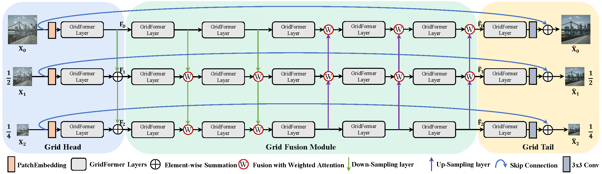
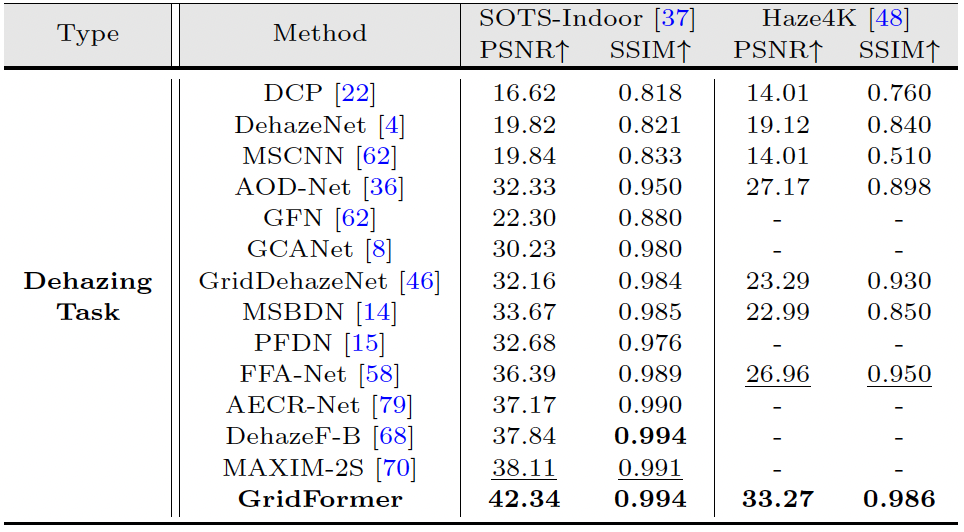
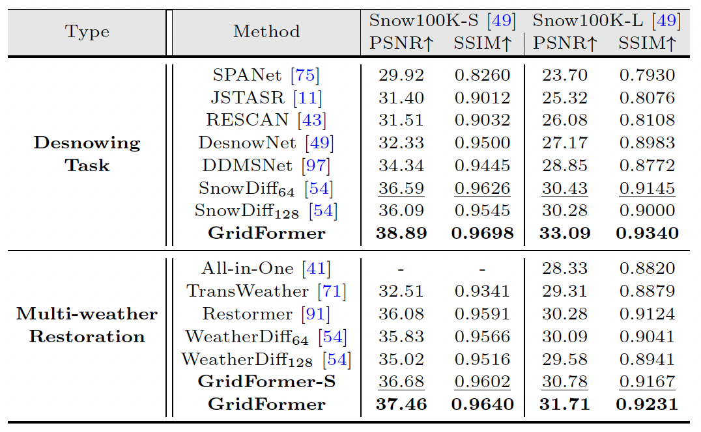
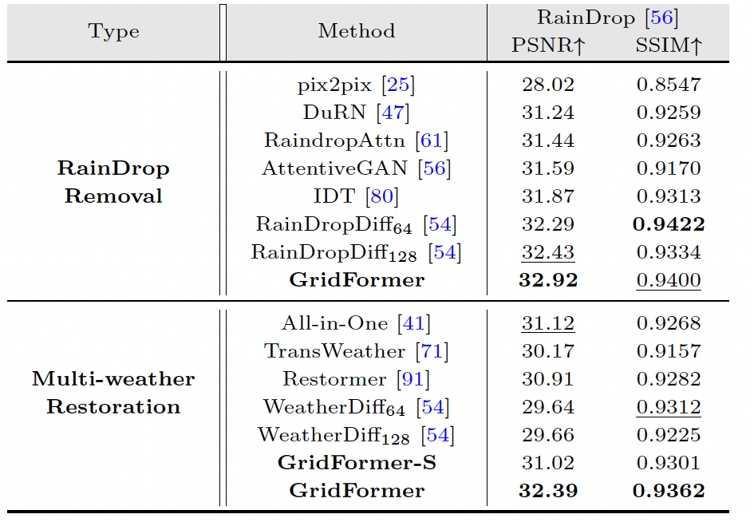
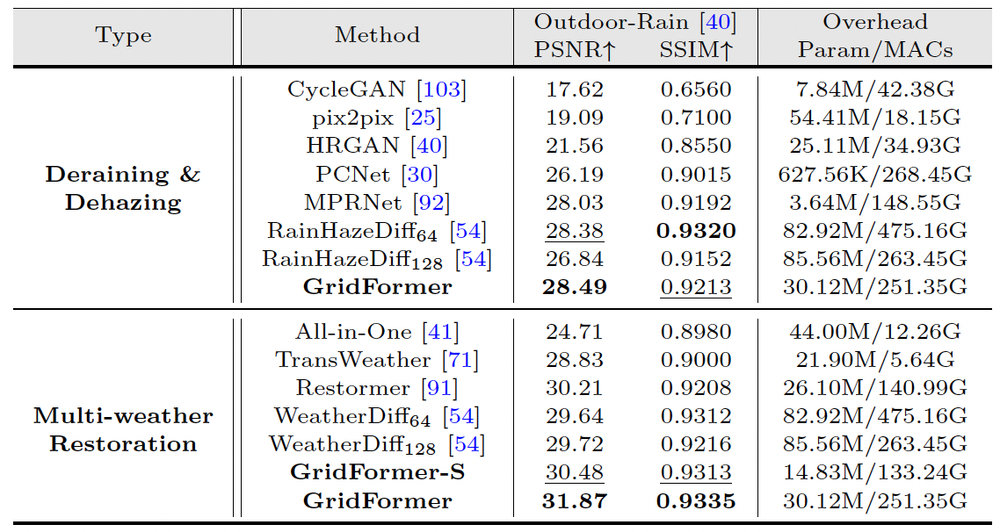

# GridFormer: Residual Dense Transformer with Grid Structure for Image Restoration in Adverse Weather Conditions (IJCV 2024)

[Tao Wang](https://scholar.google.com/citations?user=TsDufoMAAAAJ&hl=en), [Kaihao Zhang](https://scholar.google.com/citations?user=eqwDXdMAAAAJ&hl=en), [Ziqin Shao](), [Wenhan Luo](https://scholar.google.com/citations?user=g20Q12MAAAAJ&hl=en), [Bjorn Stenger](https://scholar.google.com/citations?user=plhjgHUAAAAJ&hl=en), [Tong Lu](https://cs.nju.edu.cn/lutong/index.htm)
[Tae-Kyun Kim](https://scholar.google.com.hk/citations?user=j2WcLecAAAAJ&hl=zh-CN),
[Wei Liu](https://scholar.google.com/citations?user=AjxoEpIAAAAJ&hl=en),
[Hongdong Li](https://scholar.google.com.hk/citations?user=Mq89JAcAAAAJ&hl=zh-CN)


[](https://arxiv.org/pdf/2305.17863)


#### News
- **Jun 24, 2024:** Pre-trained models are released!
- **Jun 24, 2024:** Codes is released!

This repository contains the dataset, code and pre-trained models for our paper.

<hr />

> **Abstract:** *Image restoration in adverse weather conditions is a difficult task in computer vision. In this paper, we propose a novel transformer-based framework called GridFormer which serves as a backbone for image restoration under adverse weather conditions. GridFormer is designed in a grid structure using a residual dense transformer block, and it introduces two core designs. First, it uses an enhanced attention mechanism in the transformer layer. The mechanism includes stages of the sampler and compact self-attention to improve efficiency, and a local enhancement stage to strengthen local information. Second, we introduce a residual dense transformer block (RDTB) as the final GridFormer layer. This design further improves the network’s ability to learn effective features from both preceding and current local features. The GridFormer framework achieves state-of-the-art results on five diverse image restoration tasks in adverse weather conditions, including image deraining, dehazing, deraining & dehazing, desnowing, and multi-weather restoration.* 
<hr />

## Network Architecture


### Datasets

| Task | Dataset| Links |
|:----|:----|:----|
|Image Dehazing| ITS |  [Baidu cloud plate](https://pan.baidu.com/s/1MDeL3O8qfDuBp3ItOsGlbA?pwd=65h2)|
|Image Dehazing| SOTS-indoor |  [Baidu cloud plate](https://pan.baidu.com/s/1Ezik5nUv4TwbIs2NTWutgg?pwd=yx6c)|
|GridFormer-Haze4K|Haze4K|[Baidu cloud plate](https://pan.baidu.com/s/1dfBsL76stv5PWgJD864YLw?pwd=683z)|
|GridFormer-Snow100K|Snow100k| [Baidu cloud plate](https://pan.baidu.com/s/1qLQViQAhlIaD5EqhHPNRqg?pwd=m2vf)|
|GridFormer-RainDrop|RainDrop|[Baidu cloud plate](https://pan.baidu.com/s/1cmQdSO-l0VmJ_Rueybk0UQ?pwd=fe86)|
|GridFormer-Outdoor-Rain|Outdoor-Rain| [Baidu cloud plate](https://pan.baidu.com/s/1VE4e7C1M4nFnqaqZp_4ayg?pwd=5gb7)|
|GridFormer-Multi-weather-Restoration|Mix|[Baidu cloud plate](https://pan.baidu.com/s/1CpfxSyRo3dJVQG81EpENHQ?pwd=1jua)|


### Pre-trained Models
| Name | Dataset| Pre-trained models | Configs |
|:----|:----|:----|-----|
|GridFormer-SOTS-Indoor|SOTS-Indoor|[gdrive](https://drive.google.com/drive/folders/18OnOUkwfbpltn_i384z62m0cwrnHsnHL?usp=sharing)  \|  [Baidu cloud plate](https://pan.baidu.com/s/1-kCOBnsIbBJMFdpCfiUYvA?pwd=5bls)|[train](./options/train/GridFormer/Dehazing/SOTS-Indoor/GridFormer_SOTS-Indoor.yml) \| [test](./options/test/GridFormer/Dehazing/SOTS-Indoor/GridFormer_SOTS-Indoor.yml)|
|GridFormer-Haze4K|Haze4K|[gdrive](https://drive.google.com/drive/folders/1TPDn9_5Lww7OWKf_zq0s1OpIRjfWm5mS?usp=sharing)  \|  [Baidu cloud plate](https://pan.baidu.com/s/1xJ8dG3xeaXSWvJhIjCReDQ?pwd=xet5)|[train](./options/train/GridFormer/Dehazing/Haze4K/GridFormer_Haze4K.yml) \| [test](./options/test/GridFormer/Dehazing/Haze4K/GridFormer_Haze4K.yml)|
|GridFormer-Snow100K|Snow100k|[gdrive](https://drive.google.com/drive/folders/18EANFEjoerJsOaVpCIeMxiJ29P3CFODi?usp=sharing)  \|  [Baidu cloud plate](https://pan.baidu.com/s/1hSuBWnfgZAtDibt5TJDkvg?pwd=pgxy )|[train](./options/train/GridFormer/Desnowing/GridFormer_Snow100K.yml) \| [test](./options/test/GridFormer/Desonwing/GridFormer_Snow100K.yml)|
|GridFormer-RainDrop|RainDrop|[gdrive](https://drive.google.com/drive/folders/1nRLw354icekUQRFRpVidVrrVeHAxLpzI?usp=sharing)  \|  [Baidu cloud plate](https://pan.baidu.com/s/1HaJV-utd5D3xrV8XYX5khA?pwd=7d1w)|[train](./options/train/GridFormer/Raindrop_Removal/GridFormer_RainDrop.yml) \| [test](./options/test/GridFormer/Raindrop_Removal/GridFormer_RainDrop.yml)|
|GridFormer-Outdoor-Rain|Outdoor-Rain|[gdrive](https://drive.google.com/drive/folders/14XEcTU_dAawCZglHLVjF4yFdbGuLbc4z?usp=sharing)  \|  [Baidu cloud plate](https://pan.baidu.com/s/1oBr8DrKlNrLOzRJHdKS05w?pwd=lszg)|[train](./options/train/GridFormer/Dehazing&Deraining/GridFormer_Outdoor-Rain.yml) \| [test](./options/test/GridFormer/Dehazing&Deraining/GridFormer_Outdoor-Rain.yml)|
|GridFormer-Multi-Weather|Mix|[gdrive](https://drive.google.com/drive/folders/1jLHWQwzUMb6rOmZ4S0vnIBnxfmh7sf4Z?usp=sharing)  \|  [Baidu cloud plate](https://pan.baidu.com/s/1T0lc2LFc-OJCkFFms5h3Tg?pwd=xjr3)|[train](./options/train/GridFormer/Multi_weather_Restoration/GridFormer_mixed.yml) \| [test](./options/test/GridFormer/Multi_weather_Restoration/GridFormer_mixed.yml)|


## Results
Experiments are performed for image restoration in adverser weather cnditions tasks including, image dehazing, image desnowing, Raindrop removal, image deraining & image dehazing, and multi-weather restoration. 

<details>
<summary><strong>Image Dehazing</strong> (click to expand) </summary>

<p align="center"> </p>
</details>

<details>
<summary><strong>Image Desnowing</strong> (click to expand) </summary>

<p align="center"></p></details>

<details>
<summary><strong>Raindrop Removal</strong> (click to expand) </summary>


 
</details>


<details>
<summary><strong>Image Deraining & image Dehazing</strong> (click to expand) </summary>


</details>

## Get Started
### Dependencies and Installation
1. Create Conda Environment 
```
conda create -n GridFormer python=3.7
conda activate GridFormer
conda install pytorch=1.8 torchvision cudatoolkit=10.2 -c pytorch
pip install matplotlib scikit-learn scikit-image opencv-python yacs joblib natsort h5py tqdm
pip install einops gdown addict future lmdb numpy pyyaml requests scipy tb-nightly yapf lpips
```
2. Clone Repo
```
git clone https://github.com/TaoWangzj/GridFormer.git
```

3. Install basicsr

```
cd GridFormer
python setup.py develop 
```


## Train (we use the dehazing for an example)

1. To download training and testing data


3. To train GridFormer, run
```
cd GridFormer
./train.sh options/train/GridFormer/Dehazing/SOTS-Indoor/GridFormer_SOTS-Indoor.yml
```
**Note:** The above training script uses 8 GPUs by default. To use any other number of GPUs, modify [GridFormer/train.sh](./train.sh) and [GridFormer_SOTS-Indoor.yml](./options/train/GridFormer/Dehazing/SOTS-Indoor/GridFormer_SOTS-Indoor.yml)


## Test

1. Download the pre-trained [model](https://drive.google.com/drive/folders/18OnOUkwfbpltn_i384z62m0cwrnHsnHL?usp=sharing) and place it in `./checkpoints/`

2. Testing
```
python basic/test.py -opt  options/test/GridFormer/Dehazing/SOTS-Indoor/GridFormer_SOTS-Indoor.yml
```

## Citation
If you use GridFormer, please consider citing:

    @article{wang2024gridformer,
        title={Gridformer: Residual dense transformer with grid structure for image restoration in adverse weather conditions}, 
        author={Gridformer: Residual dense transformer with grid structure for image restoration in adverse weather conditions},
        journal={International Journal of Computer Vision},
        pages={1--23},
        year={2024}
    }

## Contact
If you have any questions, please contact taowangzj@gamil.com

**Acknowledgment:** This code is based on the [BasicSR](https://github.com/xinntao/BasicSR) toolbox and [Restormer](https://github.com/megvii-model/HINet). 

---
<details>
<summary>statistics</summary>


</details>
